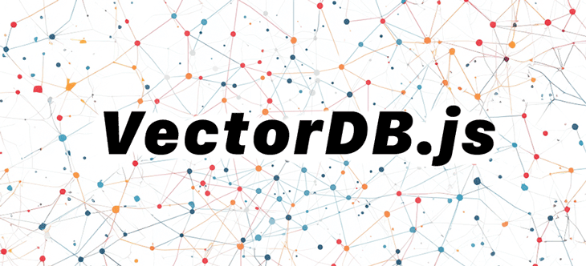

## VectorDB.js



<div class="badges" style="text-align: center; margin-top: -10px;">
<a href="https://github.com/themaximal1st/vectordb.js"></a>
<a href="https://www.npmjs.com/package/@themaximalist/vectordb.js"></a>
<a href="https://github.com/themaximal1st/vectordb.js"></a>
<a href="https://github.com/themaximal1st/vectordb.js"></a>
</div>
<br />

`VectorDB.js` is a simple in-memory vector database for Node.js. It's an easy way to do text similarity. 

-   Works 100% locally and in-memory by default
-   Uses [hnswlib-node](https://github.com/yoshoku/hnswlib-node) for simple vector search
-   Uses [Embeddings.js](https://embeddingsjs.themaximalist.com) for simple text embeddings
-   Supports OpenAI, Mistral and local embeddings
-   Caches embeddings
-   Automatically resizes database size
-   Store objects with embeddings
-   MIT license


## Install 

Install `VectorDB.js` from NPM:

```bash
npm install @themaximalist/vectordb.js
```

For local embeddings, install the transformers library:

```bash
npm install @xenova/transformers
```

For remote embeddings like OpenAI and Mistral, add an API key to your environment.

```bash
export OPENAI_API_KEY=...
export MISTRAL_API_KEY=...
```


## Usage

To find similar strings, add a few to the database, and then search.

```javascript
import VectorDB from "@themaximalist/vectordb.js"
const db = new VectorDB();

await db.add("orange");
await db.add("blue");

const result = await db.search("light orange");
// [ { input: 'orange', distance: 0.3109036684036255 } ]
```


## Embedding Models

By default `VectorDB.js` uses a local embeddings model.

To switch to another model like OpenAI, pass the service to the `embeddings` config.

```javascript
const db = new VectorDB({
  dimensions: 1536,
  embeddings: {
    service: "openai"
  }
});

await db.add("orange");
await db.add("blue");
await db.add("green");
await db.add("purple");

// ask for up to 4 embeddings back, default is 3
const results = await db.search("light orange", 4);
assert(results.length === 4);
assert(results[0].input === "orange");
```

With Mistral Embeddings:

```javascript
const db = new VectorDB({
  dimensions: 1024,
  embeddings: {
    service: "mistral"
  }
});

// ...
```

Being able to easily switch embeddings providers ensures you don't get locked in!

`VectorDB.js` was built on top of [Embeddings.js](https://embeddingsjs.themaximalist.com/), and passes the full `embeddings` config option to `Embeddings.js`.


## Custom Objects

`VectorDB.js` can store any valid JavaScript object along with the embedding.

```javascript
const db = new VectorDB();

await db.add("orange", "oranges");
await db.add("blue", ["sky", "water"]);
await db.add("green", { "grass": "lawn" });
await db.add("purple", { "flowers": 214 });

const results = await db.search("light green", 1);
assert(results[0].object.grass == "lawn");
```

This makes it easy to store metadata about the embedding, like an object id, URL, etc...


## API

The `VectorDB.js` library offers a simple API for using vector databases. To get started, initialize the `VectorDB` class with a config object.


```javascript
new VectorDB({
  dimensions: 384, // Default: 384. The dimensionality of the embeddings.
  size: 100,       // Default: 100. Initial size of the database; automatically resizes
  embeddings: {
    service: "openai" // Configuration for the embeddings service.
  }
});
```

**Options**

* **`dimensions`** `<int>`: Size of the embeddings. Default is `384`.
* **`size`** `<int>`: Initial size of the database, will automatically resize. Default is `100`.
* **`embeddings`** `<object>`: [Embeddings.js](https://embeddingsjs.themaximalist.com) config options
  * **`service`** `<string>`: The service for generating embeddings, `transformer`, `openai` or `mistral`


**Methods**

<div class="compressed-group">

#### `async add(input=<string>, obj=<object>)`

Adds a new text string to the database, with an optional JavaScript object.

```javascript
await vectordb.add("Hello World", { dbid: 1234 });
```

#### `async search(input=<string>, num=<int>, threshold=<float>)`

Search the vector database for a string input, no more than `num` and only if the distance is under `threshold`.

```javascript
// 5 results closer than 0.5 distance
await vectordb.search("Hello", 5, 0.5);
```

#### `resize(size=<number>)`

Resizes the database to specific size, handled automatically but can be set explicitly.

```javascript
vectordb.resize(size);
```
</div>

**Response**

`VectorDB.js` returns results from `vectordb.search()` as a simple array of objects that follow this format:

* **`input`** `<string>`: Text string match
* **`distance`** `<float>`: Similarity to search string, lower distance means more similar.
* **`object`** `<object>`: Optional object returned if attached

```javascript

[
  {
      input: "Red"
      distance: 0.54321,
      object: {
      	dbid: 123
      }
  }
]
```

## Debug

`VectorDB.js` uses the `debug` npm module with the `vectordb.js` namespace.

View debug logs by setting the `DEBUG` environment variable.

```bash
> DEBUG=vectordb.js*
> node src/run_vector_search.js
# debug logs
```

The `VectorDB.js` API aims to make it simple to do text similarity in Node.js—without getting locked into an expensive cloud provider or embedding model.

## Deploy

`VectorDB.js` works great by itself, but was built side-by-side to work with [Model Deployer](https://modeldeployer.com).

Model Deployer is an easy way to deploy your [LLM](https://llmjs.themaximalist.com) and Embedding models in production. You can monitor usage, rate limit users, generate API keys with specific settings and more.

It's especially helpful in offering options to your users. They can download and run models locally, they can use your API, or they can provide their own API key.

It works out of the box with VectorDB.js.

```javascript
const db = new VectorDB({
  embeddings: {
    service: "modeldeployer",
    model: "api-key",
  }
});

await db.add("orange", "oranges");
await db.add("blue", ["sky", "water"]);
await db.add("green", { "grass": "lawn" });
await db.add("purple", { "flowers": 214 });

const results = await db.search("light green", 1);
assert(results[0].object.grass == "lawn");
```

Learn more about [deploying embeddings with Model Deployer](https://modeldeployer.themaximalist.com).


## Projects

`VectorDB.js` is currently used in the following projects:

-   [AI.js](https://aijs.themaximalist.com) — simple AI library
-   [Model Deployer](https://modeldeployer.com) — deploy AI models in production
-   [HyperType](https://hypertypelang.com) — knowledge graph toolkit
-   [HyperTyper](https://hypertyper.com) — multidimensional mind mapping


## License

MIT


## Author

Created by [The Maximalist](https://twitter.com/themaximal1st), see our [open-source projects](https://themaximalist.com/products).

